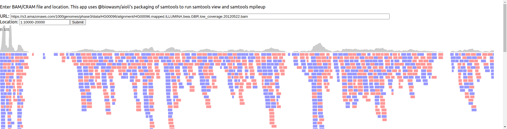

# gmodbam_demo

Demo using @gmod/bam to fetch features and render a simple pileup

Compare to https://github.com/cmdcolin/aioli_demo

Note that it is a fair bit faster than the aioli demo because it just parses the plain binary instead of aioli where it parses the text output of the samtools view command essentially

Example

http://cmdcolin.github.io/gmodbam_demo/?file=https%3A%2F%2Fs3.amazonaws.com%2F1000genomes%2Fphase3%2Fdata%2FHG00096%2Falignment%2FHG00096.mapped.ILLUMINA.bwa.GBR.low_coverage.20120522.bam&loc=1%3A10000-20000
